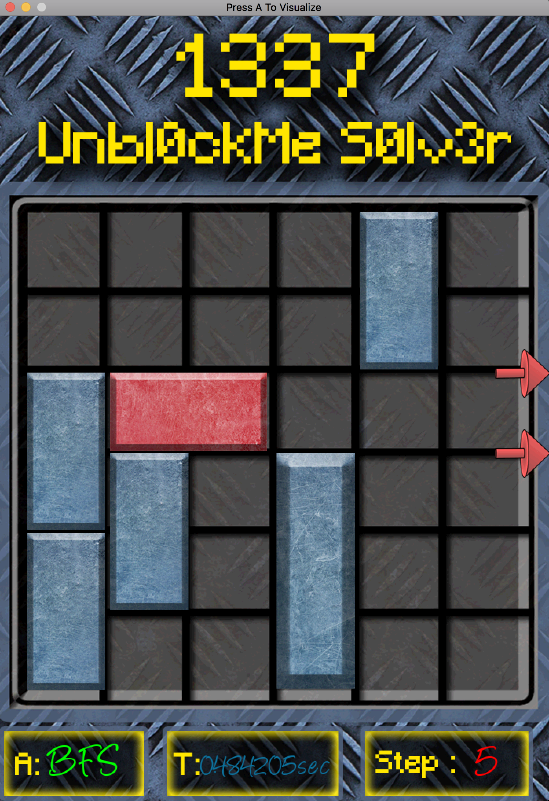

# Unblock-me

Usage
 
---> ./Unblock-me bfs data/input.txt data/output.txt
 
---> ./Unblock-me dfs data/input.txt data/output.txt
 
respectively for bfs and dfs
 
Press A to viusualize once The Algorithm  has complete it's task
 

Reference https://github.com/karakanb/unblock-me-solver
